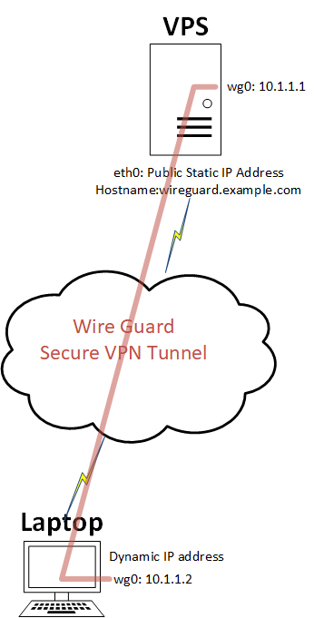

# Wireguard for remotely accessing VPS with Linux Clients which have a dynaminc IP address

I have a VPS on the interent which has a public IP address. I have never been a great fan of exposing SSH and Other services which i only i need access to. I normally lock down the firewalls on the VPS for the services to static a Publix IP address i will be sitting behind, Normally my home broadband connection or my work office. Latley i have been traveling alot and need to access one of these services but did not have acess to come from one of these static Public IP address.

I would like to set up a simple client to Server VPN Configuartion, so i dont need to come from a static public IP address. I heard of wireguard back at Oggcamp and sort i give it a go.(and i did a talk about this a oggcamp 2019)




Above show a digram of the setup this guide provide: I have a Ubuntu 16.04 server with a public IP address and a laptop running Ubuntu which is behind router with a dynamic public ip Address and the laptop has been given a internal IP address via DHCP. We will install wireguard on both the server and laptop, create a wireguard network interface on them, gernate keys on both server and laptop. Create the config on both server and laptop. Enable firewall rules and IP forwarding the server. Test connecyive between the server and laptop

## Install Wireguard

Add the Wireguard repository to your sources list on both devices. 
```
sudo add-apt-repository ppa:wireguard/wireguard
```

Install Wireguard on both devices. The wireguard package will install all necessary dependencies.

```
sudo apt-get update
sudo apt install wireguard
```

## Generate Configs

On the server and laptop create the public and private keys.
```
 umask 077
 wg genkey | tee privatekey | wg pubkey > publickey

```
Take a note of each of the private and public key on both devices
```
cat publickey
cat privatekey
```
On the server create the wg0config file

```
sudo vi /etc/wireguard/wg0.conf
```
Add the following information and replacing the PrivateKey and PublicKey from the output of the notes you take in the previous step.
```
[Interface]
Address = 10.1.1.1/24
PrivateKey = ReplaceWithServerPrviateKey
ListenPort = 55555

[Peer]
PublicKey = ReplaceWithclientPublicKey
AllowedIPs = 10.1.1.2/32
```

On the client create the config file

```
sudo vi /etc/wireguard/wg0.conf
```
Add the following,Replacing the PrivateKey and PublicKey from the output of the notes you take in the previous step and replace the Endpoint with the public IP address or Hostname of the server.
```
[Interface]
Address = 10.1.1.2/24
PrivateKey = ReplaceWithclientprivatekey

[Peer]
PublicKey = ReplaceWithClientPublicKey
AllowedIPs = 10.1.1.0/24
Endpoint = wireguard.example.com:55555
PersistentKeepalive = 10
````

Edit firewall to allow port 55555 in. My VPS provide this so i edit the firewall rule via their portal. You may need to add this in your IP tables firewall rules.

On the server enable IP forwarding.

Edit file /etc/sysctl.conf uncommtend the following line.

```
net.ipv4.ip_forward=1
```
Run this command to make the change take effect.
```
sysctl -p
```
## Testing

bring up the interface on each device.
```
sudo wg-quick up wg0
```
type to see the state of the interfaces
```
wg
```
From the laptop you should be able to ping 10.1.1.1

To make the wg0 interface come up on every boot, Shutdwon the wg0 interface.
```
wg-quick down wg0
```
Run the following cmd to enable the wireguard as system ctrl file
```
systemctl enable wg-quick@wg0
```

